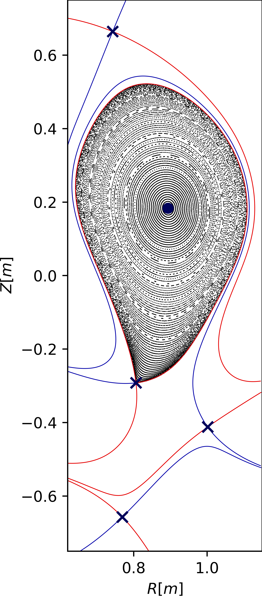
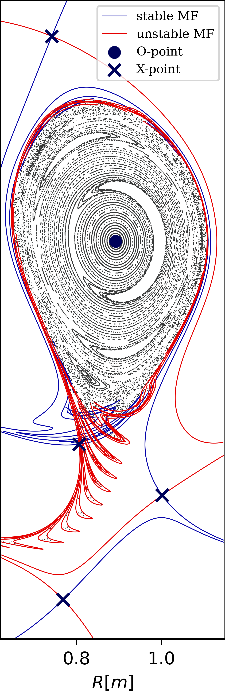
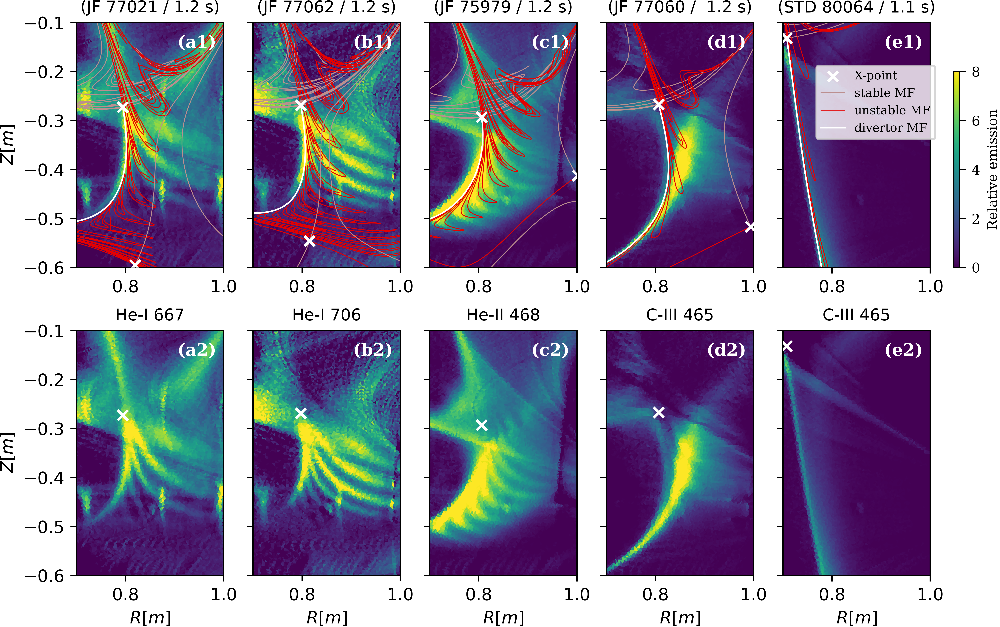

# Overview of the work

This project investigated error-field-induced homoclinic tangles in the divertor region of the TCV tokamak at EPFL, Lausanne. The aim was to investigate whether these magnetic structures could explain unusual light-emission patterns observed by the MANTIS diagnostic in configurations with secondary X-points. Figure 1 shows three “jellyfish” discharges exhibiting tentacle-like emission structures. 

Figure 1. Tomographic reconstructions of three “jellyfish” discharges showing tentacle-like emission structures in the divertor region.

The working hypothesis was that these structures arise from magnetic tangles induced by error fields associated with non-axisymmetric displacements of the poloidal field (PF) coils. The first step was therefore to estimate these displacements from magnetic measurements.

## 1. Estimation of non-axisymmetric PF coil displacements
The coil displacements were estimated using the method described by [F. Piras et al.](https://www.sciencedirect.com/science/article/abs/pii/S0920379610001900). This approach uses a first-order model of coil displacements and a least-squares fit to magnetic measurements from the saddle-loop system. 

For each of the 18 PF coils—16 plasma-shaping coils (E and F) and two ohmic-heating coils (OH)—four displacement parameters were considered: two centre shifts along the X and Y axes, and two tilts about the X and Y axes. These shifts and tilts break the axisymmetry of the nominal coil geometry and introduce non-axisymmetric magnetic perturbations.

To isolate the contribution of each coil, measurements from plasma-free “backoff” shots were used, with current flowing through only one coil per shot. The estimated shifts and tilts are presented in Figure 2.

  
  

  <em>Figure 2. Estimated PF coil displacements. Left: X and Y centre shifts. Right: tilts about the X and Y axes.</em>

## 2. Computation of the perturbed magnetic topology

Once the coil displacements were estimated, the corresponding non-axisymmetric magnetic perturbations ($n = 1$) were computed and added to the axisymmetric equilibrium reconstructed by [LIUQE](https://www.researchgate.net/publication/270825456_Tokamak_equilibrium_reconstruction_code_LIUQE_and_its_real_time_implementation).

To investigate the three-dimensional magnetic topology, magnetic field lines were traced and their intersections with a fixed toroidal cross-section were recorded to construct Poincaré plots. Existing tools from [pyoculus](https://pypi.org/project/pyoculus/) were adapted to use TCV equilibrium data and the computed magnetic perturbations.

Figure 3 compares the unperturbed and perturbed magnetic configurations for a “jellyfish” discharge.

  
  

  <em>Figure 3. Poincaré plots for a “jellyfish” discharge. Left: unperturbed axisymmetric configuration. Right: configuration including the estimated non-axisymmetric error fields.</em>

In the unperturbed configuration, field lines inside the separatrix remain on nested magnetic surfaces. The stable and unstable manifolds of the hyperbolic fixed point coincide, forming the separatrix that bounds this region.

In the perturbed configuration, these manifolds split and intersect, forming a homoclinic tangle. Their intersections delimit lobes that allow field lines to move between regions through [the tunstile transport mechanism](https://doi.org/10.1063/1.4915831).

## 3. Comparison with MANTIS observations

The computed manifolds were overlaid on tomographic reconstructions of the MANTIS light emission to assess their spatial correspondence with the observed tentacle-like structures. The agreement provides qualitative support for the hypothesis that these emission patterns are associated with plasma transport from the confined region through the turnstile transport mechanism. For more detailed explanations, please refer to the master's thesis.

Figure 4. Comparison of computed magnetic manifolds and MANTIS emission in the divertor region. Top row: manifolds overlaid on MANTIS tomographic reconstructions. Bottom row: corresponding reconstructions without overlays. The comparison shows a qualitative spatial correspondence between the manifolds and the tentacle-like emission structures. This figure differs from the comparison presented in the master's thesis.

## 4. Further analyses

Further analyses are available in the master's thesis and will be summarised here in a future update.

## My contributions

- Building on an initial fitting script developed by C. Heiss, I further developed and refined the coil-displacement estimation procedure. I removed magnetic probe measurements from the fit, adapted the regularisation procedure and added error bars to the estimated displacements.
- I adapted existing pyoculus tools to TCV experimental magnetic configurations with support from C. Smiet.
- I carried out the analyses with guidance from J. Loizu and C. Smiet.
- I produced the plots and developed or adapted the scripts included in this repository.

Additional MANTIS tomographic reconstructions were computed by R. L. Morgan.

A scientific paper based on this work is currently being prepared by C. Smiet, with J. Loizu and me as co-authors.

