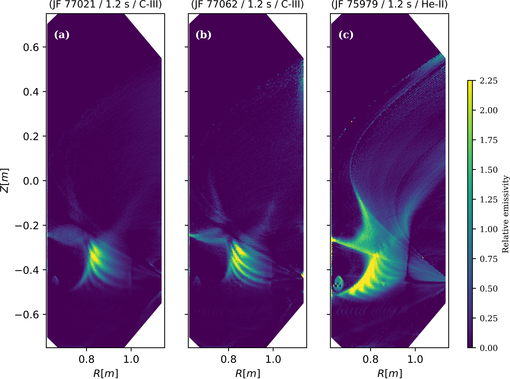
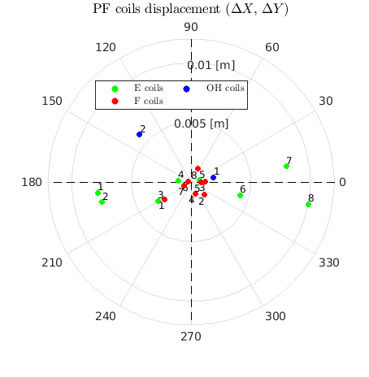
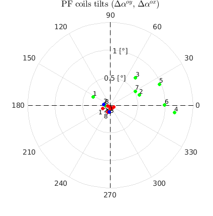

# Repository for my Master’s thesis: “[Error-field induced magnetic tangles in TCV (PDF)](V_Despland_master_project_compressed.pdf)”

This work was carried out by Victor Léonard Despland under the supervision of Dr. Christopher Smiet and Dr. Joaquim Loizu. More detailed documentation of the numerical routine and a computable example is available [here](https://gitlab.epfl.ch/spc/tcv/analysis/tokatangle).

This project investigated error-field-induced homoclinic tangles in the divertor region of the TCV tokamak at EPFL, Lausanne. The aim was to investigate whether these magnetic structures could explain unusual light-emission patterns observed by the MANTIS diagnostic in configurations with secondary X-points. Figure 1 shows three “jellyfish” discharges exhibiting tentacle-like emission structures. The computed magnetic manifolds show a qualitative spatial correspondence with the observed emission patterns (see [comparison with MANTIS observations](#3-comparison-with-mantis-observations)).

*Figure 1. Tomographic reconstructions of three “jellyfish” discharges showing tentacle-like emission structures in the divertor region.*

The working hypothesis was that these structures arise from magnetic tangles induced by error fields associated with non-axisymmetric displacements of the poloidal field (PF) coils. This is the first step of this work.

## 1. Estimation of non-axisymmetric PF coil displacements
The coil displacements were estimated using the method described by [F. Piras et al.](https://www.sciencedirect.com/science/article/abs/pii/S0920379610001900). This approach uses a first-order model of coil displacements and a least-squares fit to magnetic measurements from the saddle-loop system.

For each of the 18 PF coils - 16 plasma shaping coil (E, F) and 2 Ohmic Heating system coils (OH) - four displacement parameters were considered: two centre shifts along the X and Y axes, and two tilts about the X and Y axes. They will induced a non-axisymmetric perturbation as they are supposed to be perfectly axisymmetric.

To isolate the contribution of each coil, measurements from plasma-free “backoff” shots were used, with current flowing through only one coil per shots. The estimated shifts and tilts are presented in Figure 2.

  
  

  <em>Figure 2. Estimated PF coil displacements. Left: X and Y centre shifts. Right: tilts about the X and Y axes.</em>

## 2. Computation of the perturbed magnetic topology

Once the coil displacements were estimated, the corresponding non-axisymmetric magnetic perturbations ($n = 1$) were computed and added to the axisymmetric equilibrium reconstructed by [LIUQE](https://www.researchgate.net/publication/270825456_Tokamak_equilibrium_reconstruction_code_LIUQE_and_its_real_time_implementation).

To investigate the three-dimensional magnetic topology, magnetic field lines were traced and their intersections with a fixed toroidal cross-section were recorded to construct Poincaré plots. Existing tools from [pyoculus](https://pypi.org/project/pyoculus/) were adapted to use TCV equilibrium data and the computed magnetic perturbations.

Figure 3 compares the unperturbed and perturbed magnetic configurations for a “jellyfish” discharge.

  
  

  <em>Figure 3. Poincaré plots for a “jellyfish” discharge. Left: unperturbed axisymmetric configuration. Right: configuration including the estimated non-axisymmetric error fields.</em>

In the unperturbed configuration, field lines inside the separatrix remain on nested magnetic surfaces. The stable and unstable manifolds of the hyperbolic fixed point coincide, forming the separatrix that bounds this region.

In the perturbed configuration, these manifolds split and intersect, forming a homoclinic tangle. Their intersections delimit lobes that allow field lines to move between regions through the turnstile transport mechanism.

For a detailed explanation, see the master's thesis and [Meiss (2015)](https://doi.org/10.1063/1.4915831).

## 3. Comparison with MANTIS observations

The computed manifolds were overlaid on tomographic reconstructions of the MANTIS light emission to assess their spatial correspondence with the observed tentacle-like structures. The agreement provides qualitative support for the hypothesis that these emission patterns are associated with plasma transport from the confined region through the turnstile transport mechanism. For further analysis and a more detailed explanation, please refer to the master's thesis.

*Figure 4 — THE MONEY SHOT - Error-field tangles for 4 Jellyfish shots and one standard shot. On top,
poincaré plots with manifolds/ fixed-points. On the middle, MANTIS/ Manifold plot
zoomed in the divertor region. On bottom, simple MANTIS diagnostic plots. The
appearance and the spatial location of the tentacles seem to correlate with the manifolds. Note that this figure is different than the figure present on the thesis.*

## My contributions

- Building on an initial fitting script developed by C. Heiss, I further developed and refined the coil-displacement estimation procedure. I removed magnetic probe measurements from the fit, adapted the regularisation procedure and added error bars to the estimated displacements.
- C. Smiet and I adapted existing pyoculus tools to TCV experimental magnetic configurations.
- I carried out the analyses with guidance from J. Loizu and C. Smiet.
- I produced the plots and scripts included in this repository and wrote the master's thesis.

A scientific paper based on this work is currently being prepared by C. Smiet, with J. Loizu and me as co-authors.

